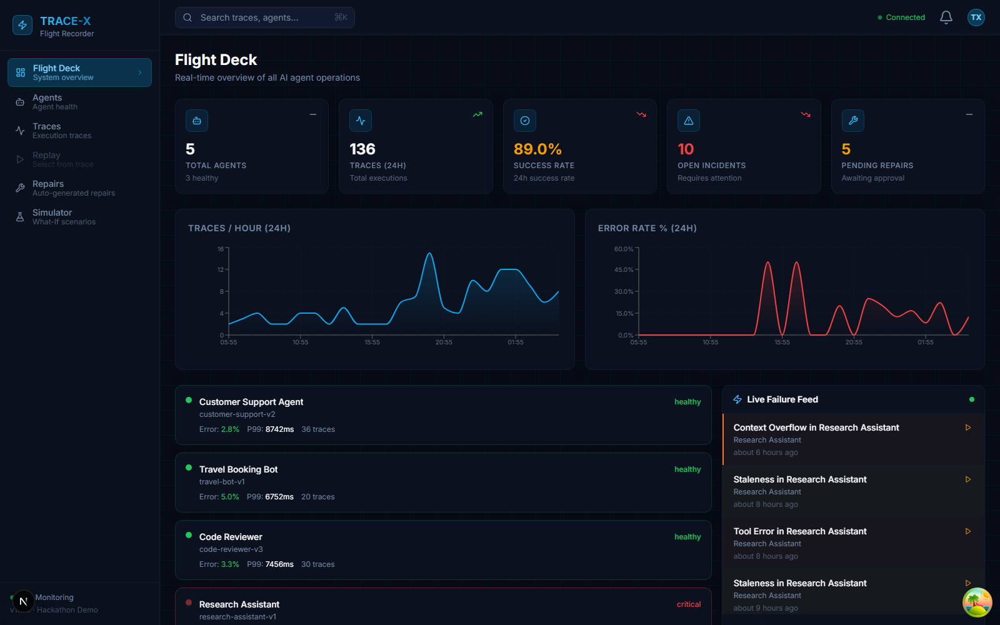
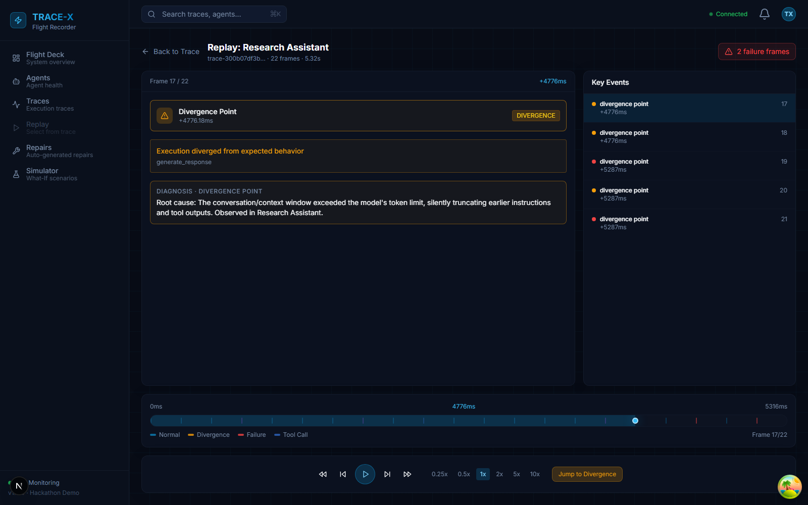
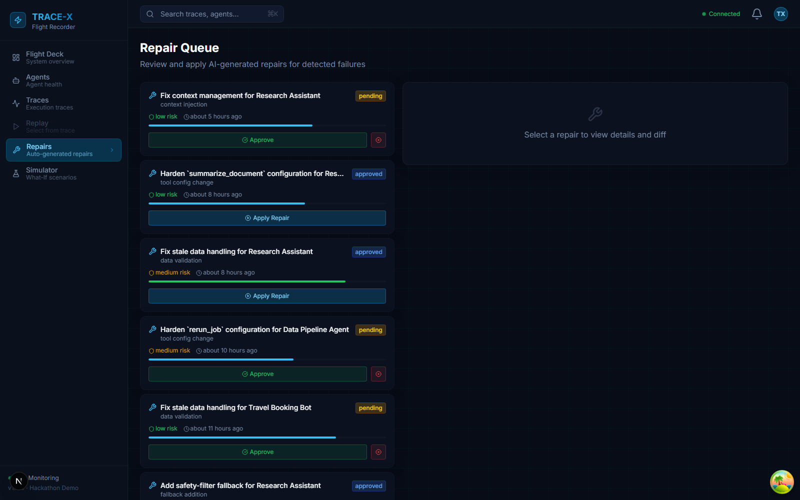
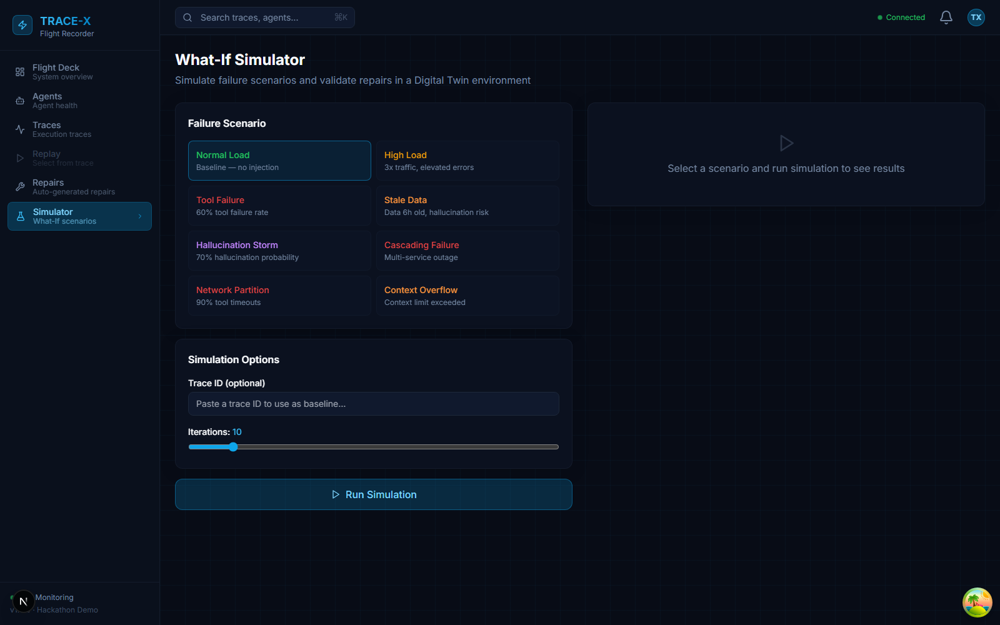

# TRACE-X — The Flight Recorder For AI Agents


> Every commercial aircraft has a black box. Your AI agents should too.

TRACE-X is an autonomous AI agent reliability platform that captures, diagnoses, repairs, and replays failures in AI agent pipelines — in real time. Built for the Google Cloud + Arize AI Hackathon.

---

## What It Does

When an AI agent fails in production, TRACE-X automatically:

1. **Captures** every LLM call, tool invocation, and decision point via the SDK
2. **Detects** anomalies in real time (Observer Agent with 7 heuristic checks)
3. **Diagnoses** root cause using Gemini 2.0 Flash + Arize MCP observability data
4. **Replays** the failure frame-by-frame like a flight data recorder
5. **Generates** a concrete code repair (patch, prompt update, retry config)
6. **Validates** the repair via automated test execution
7. **Simulates** What-If scenarios to predict repair impact before applying
8. **Tests** repairs safely in a Digital Twin environment

---

## Screenshots

| Flight Deck | Replay Center |
|---|---|
|  |  |

| Repair Queue | Simulator |
|---|---|
|  |  |

---

## Architecture

```
┌─────────────────────────────────────────────────────────────────┐
│                        Your AI Agent                            │
│  ┌──────────────────────────────────────────────────────────┐   │
│  │  tracex.trace() / @tracex.wrap  (Python SDK)             │   │
│  └──────────────────────┬───────────────────────────────────┘   │
└─────────────────────────┼───────────────────────────────────────┘
                          │ HTTP / Pub/Sub
                          ▼
┌─────────────────────────────────────────────────────────────────┐
│                    TRACE-X Backend (FastAPI)                     │
│                                                                  │
│  ┌──────────┐  ┌──────────┐  ┌──────────┐  ┌──────────────┐   │
│  │ Observer │→ │Diagnosis │→ │  Repair  │→ │ Validation   │   │
│  │  Agent   │  │  Agent   │  │  Agent   │  │   Agent      │   │
│  └──────────┘  └────┬─────┘  └──────────┘  └──────────────┘   │
│                     │                                            │
│                     │ Gemini 2.0 Flash + Arize MCP              │
│                                                                  │
│  ┌─────────┐  ┌──────────┐  ┌────────────┐  ┌─────────────┐   │
│  │Firestore│  │ BigQuery │  │  Pub/Sub   │  │  WebSocket  │   │
│  └─────────┘  └──────────┘  └────────────┘  └─────────────┘   │
└─────────────────────────────────────────────────────────────────┘
                          │
                          ▼
┌─────────────────────────────────────────────────────────────────┐
│              TRACE-X Dashboard (Next.js 15 + React 19)          │
│                                                                  │
│  Flight Deck  │  Trace Explorer  │  Replay Center               │
│  Repair Queue │  What-If Sim     │  Digital Twin                │
└─────────────────────────────────────────────────────────────────┘
```

---

## Tech Stack

| Layer | Technology |
|---|---|
| Backend | Python 3.12, FastAPI, AsyncIO, Pydantic v2 |
| AI | Vertex AI Gemini 2.0 Flash (`gemini-2.0-flash-001`) |
| Observability | Arize MCP Server (with demo mock fallback) |
| Databases | Google Cloud Firestore + BigQuery |
| Streaming | Google Cloud Pub/Sub |
| Real-time | WebSocket (FastAPI native) |
| Frontend | Next.js 15, React 19, TypeScript, Tailwind CSS |
| State | TanStack Query v5, Zustand |
| Charts | Recharts, Framer Motion v11 |
| SDK | Pure Python pip package (`tracex-sdk`) |
| Infrastructure | Cloud Run, Terraform, Google Cloud Build |
| Containers | Docker multi-stage builds |

---

## Quick Start

### Option 1: Docker Compose (Recommended)

```bash
git clone https://github.com/dharshansaitech/TRACE-X.git
cd trace-x

# Copy and configure environment
cp .env.example .env
# Edit .env: set GCP_PROJECT_ID, GEMINI_API_KEY, etc.

# Start everything
docker-compose up

# In another terminal, run the demo
./demo/run_demo.sh --local
```

Open http://localhost:3000

### Option 2: Local Development

```bash
# Backend
cd backend
pip install -e ".[dev]"
uvicorn api.main:app --host 0.0.0.0 --port 8000 --reload

# Frontend (separate terminal)
cd frontend
npm install
npm run dev
# → http://localhost:3000

# SDK (separate terminal, optional)
cd sdk
pip install -e .
```

### Option 3: Full GCP Deployment

```bash
# 1. Set up GCP project
./infra/scripts/setup-gcp.sh your-project-id us-central1

# 2. Deploy with Cloud Build
gcloud builds submit --config=cloudbuild.yaml \
  --substitutions=_REGION=us-central1

# 3. OR use Terraform
cd infra/terraform
terraform init
terraform apply -var="project_id=your-project-id"
```

---

## Demo

Run the full end-to-end demo with all failure scenarios:

```bash
# Full demo (starts Docker, seeds data, injects failures)
./demo/run_demo.sh

# Quick demo (assumes backend running)
./demo/run_demo.sh --quick

# Individual pieces
python demo/seed_data.py --hours 48 --count 300
python demo/inject_failure.py --all
python demo/agents/travel_bot.py --inject tool_failure
python demo/agents/travel_bot.py --inject hallucination
python demo/agents/travel_bot.py --inject stale_data
```

---

## SDK Usage

```python
import tracex

# Initialize (call once at startup)
tracex.init(
    backend_url="https://your-tracex-backend.run.app",
    api_key="your-api-key",
    agent_id="my-agent-v1",
)

# Option 1: Decorator
@tracex.trace(name="my_agent_task")
async def run_agent(user_input: str) -> str:
    # your agent code here
    return result

# Option 2: Context manager
async with tracex.span("process_request") as span:
    span.set_input({"query": user_input})
    result = await call_llm(user_input)
    span.set_output({"result": result})
    span.set_tokens(prompt=450, completion=120)

# Option 3: Wrap an existing agent class
wrapped_agent = tracex.wrap(MyAgent(), agent_name="my-agent")
result = await wrapped_agent.run("user message")

# Flush before shutdown
await tracex.flush()
```

---

## Key Features

### Flight Deck Dashboard
Real-time monitoring of all agents with MetricCards (traces/hour, error rate, MTTR, active agents, cost), area chart for trend visualization, agent health grid, and live failure feed.

### Replay Center
Frame-by-frame replay of any agent execution — like a flight data recorder. Navigate using playback controls (play/pause/step/speed), jump to the exact divergence point, and inspect each LLM prompt, tool call, and error in detail.

### Autonomous Repair Pipeline
When a failure is detected, TRACE-X automatically:
- Diagnoses root cause (Gemini 2.0 Flash + Arize MCP similarity search)
- Generates a concrete code repair with unified diff
- Validates the repair against test cases
- Presents for one-click human approval

### What-If Simulator
Run parameterized failure injection scenarios before applying repairs:
- 8 presets: normal, high_load, tool_failure, stale_data, hallucination, cascading_failure, network_partition, context_overflow
- Configurable iterations with statistical aggregation
- Delta comparison: success rate, latency, cost impact

### Digital Twin
Test repairs in a safe isolated environment that mirrors production before applying to live agents.

---

## API Reference

Base URL: `http://localhost:8000/api/v1` (dev) or your Cloud Run URL (prod)

Interactive docs: http://localhost:8000/docs

### Traces
| Method | Path | Description |
|---|---|---|
| POST | `/traces/ingest` | Ingest a new agent trace |
| GET | `/traces` | List traces with filters |
| GET | `/traces/{id}` | Get trace detail |
| GET | `/traces/{id}/replay` | Get replay session |
| DELETE | `/traces/{id}` | Delete trace |

### Repairs
| Method | Path | Description |
|---|---|---|
| GET | `/repairs` | List all repairs |
| GET | `/repairs/{id}` | Get repair detail |
| POST | `/repairs/{id}/approve` | Approve a repair |
| POST | `/repairs/{id}/apply` | Apply a repair |
| POST | `/repairs/{id}/rollback` | Roll back a repair |

### Dashboard
| Method | Path | Description |
|---|---|---|
| GET | `/dashboard/overview` | System overview metrics |
| GET | `/dashboard/incidents` | Recent incidents |
| GET | `/agents` | All registered agents |
| GET | `/agents/{id}/health` | Agent health metrics |

### Simulator
| Method | Path | Description |
|---|---|---|
| POST | `/simulator/simulate` | Run What-If simulation |
| GET | `/simulator/twins` | List Digital Twins |
| POST | `/simulator/twins` | Create a Digital Twin |
| POST | `/simulator/twins/{id}/test` | Run test suite on twin |

### WebSocket
```
ws://localhost:8000/ws?channel=global
ws://localhost:8000/ws?channel=traces
ws://localhost:8000/ws?channel=repairs
```

---

## Environment Variables

### Backend (`.env`)
```env
GCP_PROJECT_ID=your-project-id
GCP_REGION=us-central1
ENVIRONMENT=development

# Vertex AI
GOOGLE_CLOUD_PROJECT=your-project-id
GEMINI_MODEL=gemini-2.0-flash-001

# Arize MCP (optional — falls back to demo mock)
ARIZE_MCP_URL=http://localhost:8765
ARIZE_API_KEY=your-arize-key

# Auth
API_KEY=your-tracex-api-key

# Firestore
FIRESTORE_DATABASE=(default)

# BigQuery
BIGQUERY_DATASET=tracex_analytics

# Pub/Sub
PUBSUB_TRACES_TOPIC=tracex-traces
PUBSUB_EVENTS_TOPIC=tracex-events
```

### Frontend (`.env.local`)
```env
NEXT_PUBLIC_API_URL=http://localhost:8000/api/v1
NEXT_PUBLIC_WS_URL=ws://localhost:8000/ws
NEXT_PUBLIC_API_KEY=your-tracex-api-key
```

---

## Running Tests

```bash
cd backend

# All tests
pytest tests/ -v

# Specific suites
pytest tests/test_ingestion.py -v
pytest tests/test_diagnosis.py -v
pytest tests/test_repair.py -v
pytest tests/test_replay.py -v

# With coverage
pytest tests/ --cov=api --cov=agents --cov=replay --cov-report=html
```

---

## Project Structure

```
trace-x/
├── backend/
│   ├── api/
│   │   ├── main.py               # FastAPI app + lifespan
│   │   ├── config.py             # Settings via pydantic-settings
│   │   ├── dependencies.py       # Singleton GCP clients
│   │   ├── middleware.py         # Logging, timing, auth
│   │   ├── websocket_manager.py  # Channel-based WebSocket
│   │   ├── schemas/              # Pydantic v2 models
│   │   └── routes/               # API route handlers
│   ├── agents/
│   │   ├── orchestrator.py       # Pipeline coordinator
│   │   ├── observer/             # Anomaly detection
│   │   ├── diagnosis/            # Root cause analysis
│   │   ├── repair/               # Code repair generation
│   │   └── validation/           # Repair validation
│   ├── services/
│   │   ├── firestore_service.py  # Operational storage
│   │   ├── bigquery_service.py   # Analytics storage
│   │   ├── pubsub_service.py     # Message streaming
│   │   └── gemini_service.py     # Vertex AI wrapper
│   ├── mcp/
│   │   └── arize_mcp_client.py   # Arize MCP integration
│   ├── replay/
│   │   └── engine.py             # Replay session builder
│   ├── simulator/
│   │   ├── what_if_engine.py     # What-If simulations
│   │   └── twin_manager.py       # Digital Twin
│   ├── tests/                    # Pytest test suite
│   ├── Dockerfile
│   └── pyproject.toml
├── frontend/
│   ├── app/                      # Next.js App Router pages
│   ├── components/               # React components
│   │   ├── dashboard/            # FlightDeck
│   │   ├── replay/               # ReplayCenter, FrameContent
│   │   ├── repair/               # RepairQueue
│   │   └── simulator/            # WhatIfPanel
│   ├── hooks/                    # TanStack Query hooks
│   ├── lib/                      # API client, WebSocket
│   ├── types/                    # TypeScript interfaces
│   ├── Dockerfile
│   └── package.json
├── sdk/
│   └── tracex/                   # pip-installable Python SDK
│       ├── __init__.py           # Public API
│       ├── span.py               # Span/trace dataclasses
│       ├── recorder.py           # TraceRecorder singleton
│       └── exporters/            # HTTP + Pub/Sub exporters
├── demo/
│   ├── agents/travel_bot.py      # Instrumented demo agent
│   ├── inject_failure.py         # Failure injection tool
│   ├── seed_data.py              # Historical data seeder
│   └── run_demo.sh               # End-to-end demo runner
├── infra/
│   ├── terraform/                # GCP infrastructure as code
│   └── scripts/setup-gcp.sh     # One-shot GCP setup
├── docker-compose.yml
└── cloudbuild.yaml
```

---

## Why Gemini 2.0 Flash?

- **Structured JSON output**: Diagnosis agent generates strongly-typed `DiagnosisResult` in one LLM call
- **Speed**: 2.0 Flash's low latency means diagnosis completes in < 3s for most traces
- **Function calling**: Repair agent uses tool use to generate contextual code patches
- **Long context**: Handles traces with hundreds of spans and long prompt chains

## Why Arize MCP?

The Arize MCP Server provides production observability data that the Diagnosis Agent uses to:
- Find similar historical failures (semantic trace similarity search)
- Detect feature drift between failing and healthy traces
- Get performance baselines to quantify deviation
- Score hallucination probability based on embedding distance

In demo mode (no Arize API key), full mock responses are returned so the platform works end-to-end.

---

## Hackathon Judges: Demo Checklist

- [ ] Open http://localhost:3000 → Flight Deck shows live metrics
- [ ] Run `./demo/run_demo.sh --quick` → injects 3 failure types
- [ ] Click a failed trace → view Replay Center → step through frames
- [ ] Check Repair Queue → approve a repair → see status update in real time
- [ ] Open Simulator → run "Tool Failure" preset → see success rate delta
- [ ] Check http://localhost:8000/docs → full interactive API

---

## Documentation

- [Architecture](docs/ARCHITECTURE.md) — system, sequence, and component diagrams
- [Requirements](docs/REQUIREMENTS.md) — product vision, personas, functional requirements

---

## License

MIT — built for the Google Cloud + Arize AI Hackathon.
