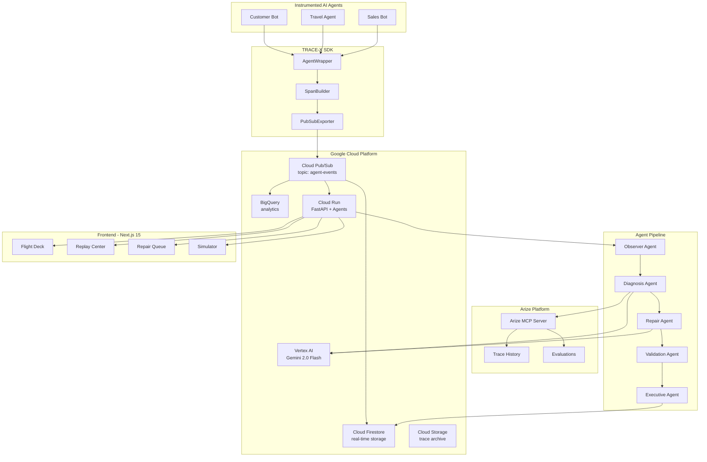
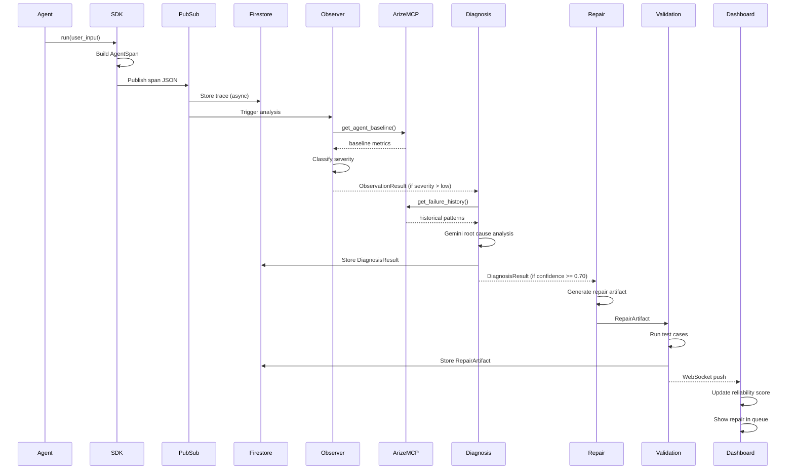
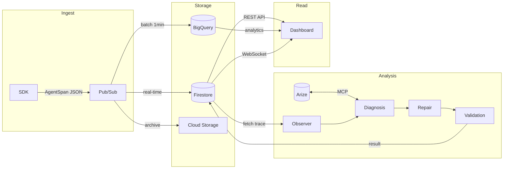
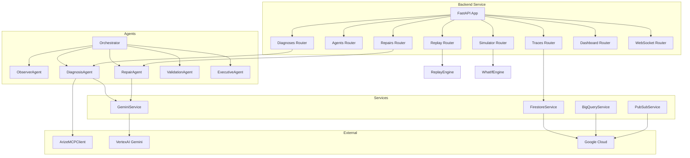

# TRACE-X — System Architecture

## High-Level Architecture

```mermaid
graph TB
    subgraph AGENTS["Instrumented AI Agents"]
        A1[Customer Bot]
        A2[Travel Agent]
        A3[Sales Bot]
    end

    subgraph SDK["TRACE-X SDK"]
        S1[AgentWrapper]
        S2[SpanBuilder]
        S3[PubSubExporter]
    end

    subgraph GCP["Google Cloud Platform"]
        PS[Cloud Pub/Sub\ntopic: agent-events]
        FS[Cloud Firestore\nreal-time storage]
        BQ[BigQuery\nanalytics]
        CR[Cloud Run\nFastAPI + Agents]
        VA[Vertex AI\nGemini 2.0 Flash]
        CS[Cloud Storage\ntrace archive]
    end

    subgraph ARIZE["Arize Platform"]
        AM[Arize MCP Server]
        AT[Trace History]
        AE[Evaluations]
    end

    subgraph PIPELINE["Agent Pipeline"]
        OBS[Observer Agent]
        DIA[Diagnosis Agent]
        REP[Repair Agent]
        VAL[Validation Agent]
        EXE[Executive Agent]
    end

    subgraph FE["Frontend - Next.js 15"]
        FD[Flight Deck]
        RC[Replay Center]
        RQ[Repair Queue]
        SIM[Simulator]
    end

    A1 --> S1
    A2 --> S1
    A3 --> S1
    S1 --> S2 --> S3 --> PS

    PS --> FS
    PS --> BQ
    PS --> CR

    CR --> OBS --> DIA --> REP --> VAL --> EXE
    DIA --> VA
    REP --> VA
    DIA --> AM
    AM --> AT
    AM --> AE

    EXE --> FS
    CR --> FD
    CR --> RC
    CR --> RQ
    CR --> SIM
```

## Event Flow Diagram

```mermaid
sequenceDiagram
    participant Agent
    participant SDK
    participant PubSub
    participant Firestore
    participant Observer
    participant ArizeМCP
    participant Diagnosis
    participant Repair
    participant Validation
    participant Dashboard

    Agent->>SDK: run(user_input)
    SDK->>SDK: Build AgentSpan
    SDK->>PubSub: Publish span JSON
    PubSub->>Firestore: Store trace (async)
    PubSub->>Observer: Trigger analysis

    Observer->>ArizeМCP: get_agent_baseline()
    ArizeМCP-->>Observer: baseline metrics
    Observer->>Observer: Classify severity
    Observer-->>Diagnosis: ObservationResult (if severity > low)

    Diagnosis->>ArizeМCP: get_failure_history()
    ArizeМCP-->>Diagnosis: historical patterns
    Diagnosis->>Diagnosis: Gemini root cause analysis
    Diagnosis->>Firestore: Store DiagnosisResult
    Diagnosis-->>Repair: DiagnosisResult (if confidence >= 0.70)

    Repair->>Repair: Generate repair artifact
    Repair->>Validation: RepairArtifact

    Validation->>Validation: Run test cases
    Validation->>Firestore: Store RepairArtifact
    Validation-->>Dashboard: WebSocket push

    Dashboard->>Dashboard: Update reliability score
    Dashboard->>Dashboard: Show repair in queue
```

## Data Flow Diagram

```mermaid
flowchart LR
    subgraph Ingest
        SDK -->|AgentSpan JSON| PUBSUB[Pub/Sub]
    end

    subgraph Storage
        PUBSUB -->|real-time| FS[(Firestore)]
        PUBSUB -->|batch 1min| BQ[(BigQuery)]
        PUBSUB -->|archive| GCS[Cloud Storage]
    end

    subgraph Analysis
        FS -->|fetch trace| OBS[Observer]
        ARIZE[(Arize)] <-->|MCP| DIA[Diagnosis]
        OBS --> DIA
        DIA --> REP[Repair]
        REP --> VAL[Validation]
        VAL -->|result| FS
    end

    subgraph Read
        FS -->|REST API| DASH[Dashboard]
        BQ -->|analytics| DASH
        FS -->|WebSocket| DASH
    end
```

## Component Diagram

```mermaid
graph TB
    subgraph Backend Service
        MAIN[FastAPI App]
        MAIN --> TR[Traces Router]
        MAIN --> AG[Agents Router]
        MAIN --> DI[Diagnoses Router]
        MAIN --> RP[Repairs Router]
        MAIN --> RL[Replay Router]
        MAIN --> SM[Simulator Router]
        MAIN --> DB[Dashboard Router]
        MAIN --> WS[WebSocket Router]
    end

    subgraph Services
        FS_SVC[FirestoreService]
        BQ_SVC[BigQueryService]
        PS_SVC[PubSubService]
        GM_SVC[GeminiService]
    end

    subgraph Agents
        ORCH[Orchestrator]
        ORCH --> OBS_A[ObserverAgent]
        ORCH --> DIA_A[DiagnosisAgent]
        ORCH --> REP_A[RepairAgent]
        ORCH --> VAL_A[ValidationAgent]
        ORCH --> EXE_A[ExecutiveAgent]
    end

    subgraph External
        MCP[ArizeМCPClient]
        VA[VertexAI Gemini]
        GCP[Google Cloud]
    end

    TR --> FS_SVC
    DI --> DIA_A
    RP --> REP_A
    RL --> REPLAY[ReplayEngine]
    SM --> SIM_E[WhatIfEngine]

    DIA_A --> GM_SVC
    DIA_A --> MCP
    REP_A --> GM_SVC
    GM_SVC --> VA
    FS_SVC --> GCP
    BQ_SVC --> GCP
    PS_SVC --> GCP
```
